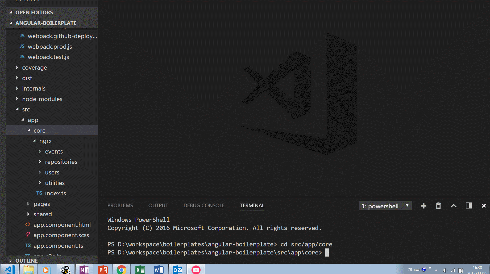

# generate-ngrx

#### Code Generator for ngrx, following best practices from [ngrx/platform/example-app](https://github.com/ngrx/platform/tree/master/example-app)


# Getting Started
Notice: this generator can only be used in node project, for ngrx4.

## Install Globally
You can install it globally then playing around with it at any ngrx projects.

Install it via npm
```
npm install generate-ngrx -g
```
```
gen-ngrx
```
Currently, this generator will generate the following files in your **working directory**
```
actions
    ----action.ts
effects
    ----effects.ts
    ----effects.spec.ts //jasmine-marbles testing
models
    ----model.ts
reducers
    ----index.ts //creating feature reducers
    ----reducers.spec.ts
    ----reducers.ts
services
    ----service.ts
index.ts // root state reducer, it will be created if not exists
```

This generator can work well if you create a **separating** folder to store all the ngrx modules. e.g. 'core/ngrx'. [like this](https://github.com/ericwang1120/angular-boilerplate/tree/master/src/app/core/ngrx). The root reducer is index.ts.

Instead of changing your working directory frequently, you can add these lines in your package.json

```
{
 "genNgrx": {
   "baseNgrxPath": "./src/app/core/ngrx" 
 }
}
```
The **baseNgrxPath** is the directory to store your ngrx modules. Then files will be generated based on the configured path.

## Install for Project
You can also install it on specific projects
```
npm install --dev generate-ngrx
```
Then add a line in your scripts of package.json
```
"scripts":{
    "generate": "gen-ngrx"
}
```
Then
```
npm run generate
```

## projects using the generator
[angular-boilerplate](https://angularb.github.io/): A boilerplate which is based on ngrx4, material design  
[source code](https://github.com/ericwang1120/angular-boilerplate)

## License
MIT
